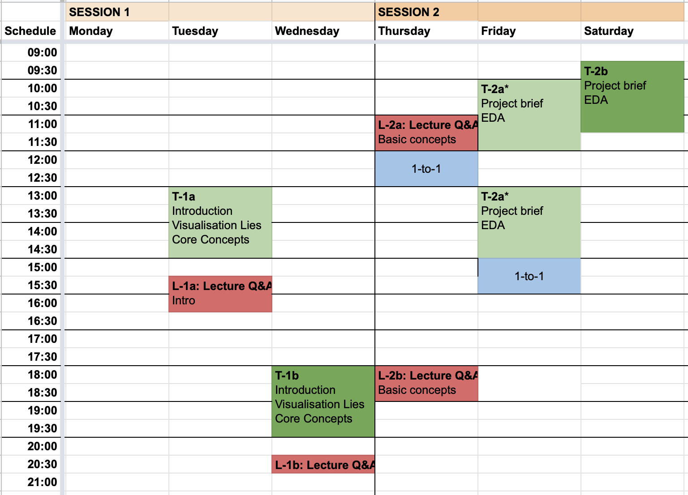

# Course Content 

<!--
[Lecture Material](lectures.md)  
[Tutorials](tutorials.md)  
-->

[Assessment](assessment.md)  
All lecture, tutorial, and assessment material found **per seession** in the table below, clicking the session numbers: e.g., 2-1, 2-2 and so forth. 

[Book 1-on-1](https://datavisonline.youcanbook.me)  
  * booking link will lapse from the end of each week's bookings, AND work again from Tues 14:00 when new bookings are available
  
[Discussion Board](https://datavisonline.slack.com)  
[VisGuides open discussion forum](https://visguides.org/) &ndash; about visualisation guidelines  
 

#### Edinburgh University Online Resources
[MyEd portal](https://www.myed.ed.ac.uk)   
[Learn VLE](https://bit.ly/sfcdv_on_learn) <!-- https://www.learn.ed.ac.uk -->  
[Library](https://discovered.ed.ac.uk)

&nbsp;

<!-- ## Learning Outcomes -->

## Course Organisation

<table>
  <tr>
    <th>Session</th>
    <th>Lectures</th>
    <th>Tutorials</th>
    <th>Assessment</th>
  </tr><tr style = "vertical-align:top;">
    <th colspan = "4"><h4>Week 1 &ndash; June 15</h4></th>
  </tr><tr style = "vertical-align:top;">
    <td>1-1</td>
    <td>
      <a href="lectures.html#1-1">Course introduction</a>
    </td><td>
      <a href="tutorials.html#1-1a">45 ways</a> 
      <a href="tutorials.html#1-1b">Visualisation lies</a> 
      <a href="tutorials.html#1-1c">Basic charts</a>
    </td><td>
    </td>
  </tr><tr style = "vertical-align:top;">
    <td>1-2</td>
    <td>
      <a href="lectures.html#1-2">Basic concepts</a> 
    </td><td>
      <a href="tutorials.html#1-2a">Formulating data visualisation brief</a> 
      <a href="tutorials.html#1-2b">Visual, exploratory data analysis (EDA)</a>
    </td><td>
      <a href="assessment.html#1-1">Project brief</a>
    </td>
  
  </tr><tr style = "vertical-align:top;">
    <th colspan = "4"><h4>Week 2 &ndash; June 22</h4></th>
  </tr>
 
  <tr style = "vertical-align:top;">
    <td>
      <a href="session-2-1">2-1</a>
    </td>
    <td>  
      <a href="session-2-1#lecture">Visualization Design</a> 
    </td>
    <td>
      <a href="session-2-1#tutorial-design-sketching">Design (Sketching)</a> 
    </td>
    <td>
      <a href="session-2-1#assignment">Project design</a>
    </td>
  </tr>

<tr style = "vertical-align:top;">
    <td>
       <a href="session-2-2">2-2</a>
    </td>
    <td>
       <a href="session-2-2#lecture">Visualization Tools</a> 
    </td>
    <td>
      <a href="session-2-2#tutorial-tool-marketplace">Visualisation tools marketplace</a> 
    </td><td>
     <a href="session-2-2#assignment">Tool review</a>
    </td>
  </tr><tr style = "vertical-align:top;">
    <th colspan = "4"><h4>Week 3 &ndash; June 29</h4></th>
  </tr><tr style = "vertical-align:top;">
    <td>3-1</td>
    <td rowspan = "2" style = "vertical-align:top;">
      <!-- a href="lectures.html#3-1" -->Foundations III: Techniques<!-- /a --> 
    </td><td>
      <a href="tutorials_week_3.html#3-1">EDA &ndash; project data</a> 
    </td><td>
    </td>
  </tr><tr style = "vertical-align:top;">
    <td>3-2</td>
    <td>
      <a href="tutorials_week_3.html#3-2">Critical analysis &amp; reflection</a>
    </td><td>
      <!-- a href="assessment.html#3-1" -->Update project brief &amp; design<!-- /a -->
    </td>
  </tr><tr style = "vertical-align:top;">
    <th colspan = "4"><h4>Week 4 &ndash; July 06</h4></th>
  </tr><tr style = "vertical-align:top;">
  <td>4-1</td>
    <td rowspan = "2" style = "vertical-align:top;">
      <!-- a href="lectures.html#4-1" -->Advanced I: Applications<!-- /a --> 
    </td><td>
      <!-- a href="tutorials.html#4-1" -->Programming Clinic &amp; Advanced topics<!-- /a -->
    </td><td>
    </td>
  </tr><tr style = "vertical-align:top;">
    <td>4-2</td>
    <td>
      <!-- a href="tutorials.html#4-2" -->Implementation &ndash; project<!-- /a -->
    </td><td>
    </td>
  </tr><tr style = "vertical-align:top;">
  <th colspan = "4"><h4>Week 5 &ndash; July 13</h4></th>
  </tr><tr style = "vertical-align:top;">
    <td>5-1</td>
    <td rowspan = "2" style = "vertical-align:top;">
      <!-- a href="lectures.html#5-1" -->Advanced II: Options<!-- /a --> 
    </td><td>
      <!-- a href="tutorials.html#5-1" -->Implementation &ndash; project<!-- /a -->
    </td><td>
    </td>
  </tr><tr style = "vertical-align:top;">
    <td>5-2</td>
    <td>
      <!-- a href="tutorials.html#5-2" -->Uability evaluation<!-- /a -->
    </td><td>
    </td>
  </tr>
</table>

***

## Timetable

* Tutorials 'a' and 'b' are the same. Tutorials 1 and 2 are different. Chose one of the sessions T-1a or T-1b and one from T-2a or T-2b.
* Q&As are opportunities for you to ask any question about the course content and engage in public discussions with all of the participants. 

<!--  -->

