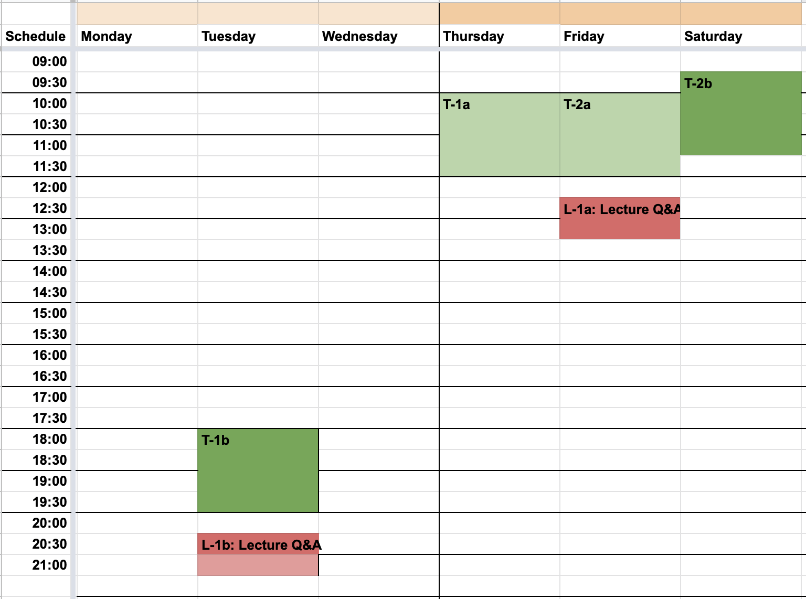
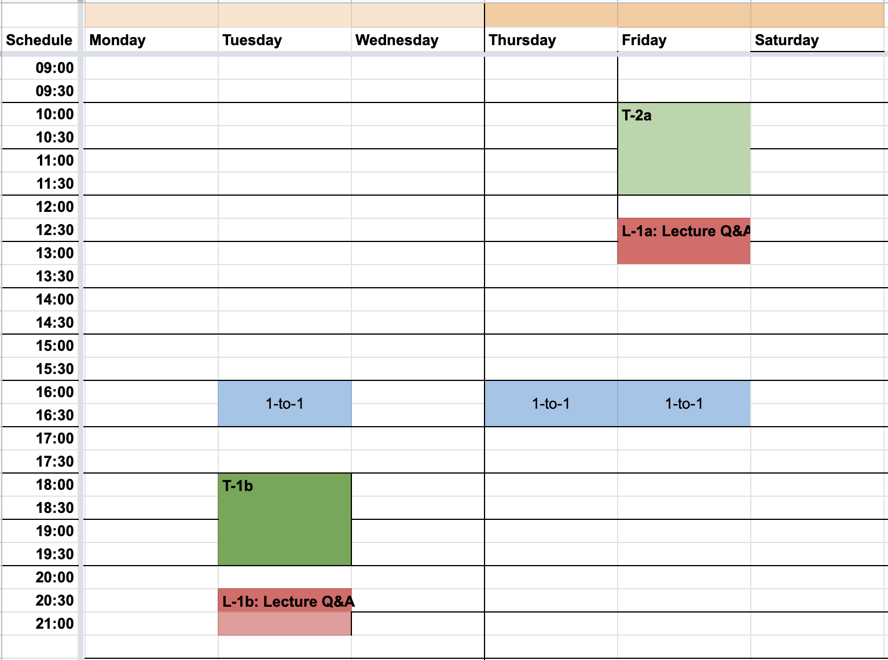

# Course Content 

This page contains links to 
* resouces, 
* the [course content](#course_organisation) for the individual weeks as well as, 
* the [schedule](#timetable). 

## What Am I Supposed To Do During a Week? 

Each week has a [topic](#course_organisation). All of that written below is optional, and serves as a guide to planning your work: 

* watch the video lectures (with accompanying slides) (~1h)
* browse any recommended reading material (~1h)
* participate in the tutorial on [Teams](http://bit.ly/DataVis4ProfTeams2021) (2h). There is a channel for each tutorial group A and B. Sessions are recorded (recordings will automatially appear in the channel); tutorial scripts are linked from the schedule.
* submit the week's quizzes via Teams and check your answers against the sample solutions (provided after submission) (~1h)
* attend the Q&A sessions in the dedicated channel on Teams. Q&A sessions are also recorded.
* some weeks do have milestone assignments, which must be submitted through [Learn VLE](http://bit.ly/sfcdv2021_on_learn). 
* update your journal.

Schedule for tutorials and Q&A sessions [below](#timetable).
 

## Resources & Important Links

Resources you may need during the course. 

* **[Teams](http://bit.ly/DataVis4ProfTeams2021):** **note** you must be logged in to your Office365 account for this course for this link to work.   
* **[Learn VLE](http://bit.ly/sfcdv2021_on_learn)**: **note** you must be logged in to the university for this link to work.
<!-- * **[Book 1-on-1](https://datavisonline.youcanbook.me)**. The booking link will lapse from the end of each week's bookings, AND work again from Tues 14:00 when new bookings are available -->

* **[MyEd portal](https://www.myed.ed.ac.uk)**   
* **[Library](https://discovered.ed.ac.uk)** to obtain copies of books and papers. 

* **[Noteable - University of Edinburgh Jupyter Notebook](https://noteable.edina.ac.uk/launch)**. The site provides an environment for Jupyter Notebooks.  
* **[University software services](https://www.ed.ac.uk/information-services/computing/desktop-personal/software)**
* **[University IT helpdesk](https://www.ed.ac.uk/information-services/help-consultancy/contact-helpline)**

* **[VisGuides open discussion forum](https://visguides.org/)** about visualisation guidelines  
* **[Books](https://visualinteractivedata.github.io/res-books)** about visualization
* **[Blogs and Collections](https://visualinteractivedata.github.io/res-collections.html)** about visualization.
 

## Recommended Books for the Course: 

* Tamara Munzner (2014) Visualization Analysis and Design: [UoE library link](https://discovered.ed.ac.uk/permalink/f/1njkql8/44UOE_ALMA51246510430002466)
* Alberto Cairo (2013) The Functional Art: An introduction to information graphics and visualization (Voices That Matter): [PDF preview pages](https://ptgmedia.pearsoncmg.com/images/9780321834737/samplepages/0321834739.pdf) &nbsp;|&nbsp; [UoE Library Link &mdash; hard copy](https://discovered.ed.ac.uk/permalink/f/gfso8q/44UOE_ALMA21114830170002466) &nbsp;|&nbsp; [UoE Library Link &mdash; soft copy](https://discovered.ed.ac.uk/permalink/f/gfso8q/44UOE_ALMA51285758880002466)
* Andy Kirk (2019) Data Visualization: A Handbook for Data Driven Design: [digital companion site](http://book.visualisingdata.com).

## [Assessment Guidelines](assessment.md)

In addition to the final project, the course has **three** assignments that need to be submitted to pass. Please note you **MUST** submit all [assignments](assessment.md) whether you attend tutorials or not. You must also attempt weekly quizzes.

## [Tutorial Guidelines](tutorials.md)

Please remember that while strongly encouraged, **participation in tutorials and all other interactive sessions is OPTIONAL**. Please read the [guidelines](tutorials.md) before attending your first interactive session; these take into account feedback from interaction with participants and the constraints inherent to a virtual classroom. 

***

## Course Organisation

<table>
  <tr>
    <th>Session</th>
    <th>Lectures</th>
    <th>Tutorials</th>
    <th>Assessment</th>
  </tr>

  <tr style = "vertical-align:top;">
    <th colspan = "4"><h4>Week 1 &ndash; May 03</h4></th>
  </tr><tr style = "vertical-align:top;">
   <td><a href="session-1-1">1-1</a></td>
   <td>
      <a href="session-1-1#lecture">Course introduction</a>
    </td><td>
      <a href="session-1-1#tutorial-fortyfive_ways">45 ways</a> 
      <a href="session-1-1#tutorial-vis_lies">Visualisation lies</a> 
      <a href="session-1-1#tutorial-basic_charts">Basic charts</a>
    </td><td>
    </td>
  </tr>
 
  <tr style = "vertical-align:top;">
   <td><a href="session-1-2">1-2</a></td>
   <td>
      <a href="session-1-2#lecture">Basic concepts</a>
    </td><td>
      <a href="session-1-2#tutorial-project_brief">Formulating data visualisation brief</a> 
      <a href="session-1-2#tutorial-eda_1">EDA &ndash; Exploratory Data Analysis</a>
    </td><td>
      <a href="session-1-2#assignment">Project brief</a>
    </td>
  </tr>

  <tr style = "vertical-align:top;">
    <th colspan = "4"><h4>Week 2 &ndash; May 10</h4></th>
  </tr><tr style = "vertical-align:top;">
   <td><a href="session-2">2</a></td>
   <td>
      <a href="session-2#lecture">Visualization Design</a> 
    </td><td>
      <a href="session-2#tutorial-design-sketching">Design (Sketching)</a> 
    </td><td>
      <a href="session-2#assignment">Project design</a>
    </td>
  </tr>
 
  <tr style = "vertical-align:top;">
     <th colspan = "4"><h4>Week 3 &ndash; May 17</h4></th>
  </tr><tr style = "vertical-align:top;">
   <td><a href="session-3">3</a></td>
    <td>
       <a href="session-3#lecture">Visualization Tools</a> 
    </td><td>
      <a href="session-3#tutorial-tool-marketplace">Visualisation tools marketplace</a> 
    </td><td>
     <a href="session-3#assignment">Tool review</a>
    </td>
  </tr>
  
  <tr style = "vertical-align:top;">
    <th colspan = "4"><h4>Week 4 &ndash; May 24</h4></th>
  </tr><tr style = "vertical-align:top;">
    <td><a href="session-4">4</a></td>
    <td style = "vertical-align:top;">
      <a href="session-4#lecture">Visualization Techniques I/II</a> 
    </td><td>
      <a href="session-4#tutorial-eda-project-data">EDA &ndash; project data</a> 
    </td><td>
      Update project brief &amp; design
    </td>
  </tr>
  
  <tr style = "vertical-align:top;">
    <th colspan = "4"><h4>Week 5 &ndash; May 31</h4></th>
  </tr><tr style = "vertical-align:top;">
    <td><a href="session-5">5</a></td>
    <td style = "vertical-align:top;">
      <a href="session-5#lecture">Visualization Techniques II/II</a> 
    </td><td>
      <a href="session-5#tutorial-critical-analysis">Critical analysis &amp; reflection</a>
    </td><td>
      Update project brief &amp; design
    </td>
  </tr>
  
  <tr style = "vertical-align:top;">
    <th colspan = "4"><h4>Week 6 &ndash; Jun 07</h4></th>
  </tr><tr style = "vertical-align:top;">
    <td><a href="session-6">6</a></td>
    <td style = "vertical-align:top;">
      <a href="session-6#lecture">Storytelling</a>
    </td><td>
      <a href="session-6#design-data-comics">Data Comics Workshop</a>
    </td><td>
    </td>
  </tr>
  
  <tr style = "vertical-align:top;">
    <th colspan = "4"><h4>Week 7 &ndash; Jun 14</h4></th>
  </tr><tr style = "vertical-align:top;">
    <td><a href="session-7">7</a></td>
    <td style = "vertical-align:top;">
      <a href="session-7#lecture">Data Physicalisation & Personal Data Visualisation</a>
    </td><td>
       <a href="session-7#tutorial-programming_clinic">Programming Clinics</a>
    </td><td>
    </td>
  </tr>
  
  <tr style = "vertical-align:top;">
    <th colspan = "4"><h4>Week 8 &ndash; Jun 21</h4></th>
  </tr><tr style = "vertical-align:top;">
    <td>8</td>
    <td style = "vertical-align:top;" colspan = 3>
      Project 1-on-1s
    </td>
  </tr>
  
  <tr style = "vertical-align:top;">
    <th colspan = "4"><h4>Week 9 &ndash; Jun 28</h4></th>
  </tr><tr style = "vertical-align:top;">
    <td><a href="session-9">9</a></td>
    <td style = "vertical-align:top;">
      <a href="session-9#lecture">Evaluation</a>
    </td><td>
      <a href="session-9#tutorial-usability-evaluation">Usability evaluation</a>
    </td><td>
      <a href="session-9#assignment">Project evaluation plan</a>
    </td>
  </tr>
  
  <tr style = "vertical-align:top;">
    <th colspan = "4"><h4>Week 10 &ndash; Jul 05</h4></th>
  </tr><tr style = "vertical-align:top;text-align: enter;">
    <td colspan = "4">Guest speaker &mdash; Tues, 6th Jul, 17:00-18:00 
      <i>Extra dimensional "XR" data visualisation.</i>, Laura Smith, CEO, Slanted Theory
    </td>
  </tr><tr style = "vertical-align:top;">
    <td colspan = "4">&nbsp;</td>
  </tr><tr style = "vertical-align:top;">
    <td><a href="session-10">10</a></td>
    <td style = "vertical-align:top;">
     <a href="session-10#lecture">Interaction</a> 
    </td><td>
      Implementation &ndash; project
    </td><td>
    </td>
  </tr>
  
</table>

&nbsp;

***

## Timetable

* The same tutorial runs twice a week to have smaller tutorial groups. The groups are A and B in the schedule. At the beginning of the course, you should choose which group you are in. 
* A is running in the mornings, 
* B is running in the evenings (+ Saturday only in week 1) 
* __Please note there is an additional tutorial session during [week 1](../images/timetable_week1_only.png):__
  * T-1: Thurs 10-12:00 (BST)
  * T-2: Sat 09:30-11:30 (BST)
* There are 2 Lecture Q&As per week. They are opportunities for you to ask any question about course content and engage in public discussions with all of the participants. You may attend any or all Q&As. The content of these sessions depends on the participants asking questions. 
* __Note all times are BST__

<!-- 
* Week 1 has a slighly different schedule than the other weeks. 
### Week 1

### Weeks 2&ndash;10

 

