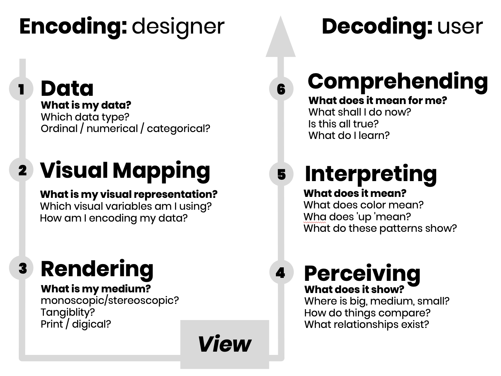

back to [course content](index#course_organisation)

# Week 1, Session 2: Visualization Design

[Lecture](#lecture) | [Reading](#reading) | [Quiz](#quiz) | [Tutorial](#tutorial) | [Assignment](#assignment)

 

#### Session topics

<table>
   <tr>
      <td>Data Vis pipeline</td>
      <td></td>
   </tr><tr>
      <td colspan = "2">Challenge -> visual encoding -> visualization -> understanding</td>
  </tr>
</table>
<!--  -->

* Visualization Pipeline
* Design thinking
   * Human-centered research
   * Double diamond
   * Iterative design
* Data Visualization Challenge
* Exploratory Data Visualization

&nbsp;

# Lecture 

### Slides
* [Working with Visualizations](files/1.2-working_with_visualizations.pdf)

#### Video lectures
* [Datavis-1.2-1: Outline (1:29)](https://drive.google.com/file/d/1O15PGttUFkCdKQo0XVEFB7iCDME2XkXx/view?usp=sharing)
* [Datavis-1.2-2: The Visualization Pipeline (12:32)](https://drive.google.com/file/d/154Pho6WP-2So2LZ1fN1_Cw4pmMw4i7t1/view?usp=sharing)
* [Datavis-1.2-3: Design Thinking (20:33)](https://drive.google.com/file/d/1QbZKKV6n6Bjlq0ksxkantDpNlFiGyqAJ/view?usp=sharing)
* [Datavis-1.2-4: Visualization Challenge (7:50)](https://drive.google.com/file/d/1raIkwNR7AdAig_l2ms--r-3mqW4uuWfM/view?usp=sharing)
* [Datavis-1.2-5:Exploratory Data Analysis (3:36)](https://drive.google.com/file/d/1DUKwgRFACkUN-riYrU4ynujJ_zEMIoSY/view?usp=sharing)
* [Datavis-1.2-6: Wrap up (1:44)](https://drive.google.com/file/d/1xYdOqP_Awt6CdwwtvdW6jJ0xCoSXugUF/view?usp=sharing)

  
  
  
##### Reading list

**Core:**  
* Tamara Munzner (2014) Visualization Analysis and Design, [chapter 4: Analysis: Four Levels for Validation](https://doi.org/10.1201/b17511-4) &nbsp;  [UoE library link](https://discovered.ed.ac.uk/permalink/f/1njkql8/44UOE_ALMA51246510430002466)

**Further reading:**  
* Berinato, Scott (2016), [Visualizations That Really Work](https://hbr.org/2016/06/visualizations-that-really-work), Harvard Business Review [UoE library link](https://discovered.ed.ac.uk/permalink/f/1s15qcp/TN_gale_ofa453813355)

&nbsp;

***

# Quiz 
Available via [Teams](https://teams.microsoft.com/l/message/19:0a2759c1c77f491fb9efb01ad14cb60a@thread.tacv2/1620231877197?tenantId=2e9f06b0-1669-4589-8789-10a06934dc61&groupId=c87825d8-9cb0-4d8c-b224-5033510ac450&parentMessageId=1620231877197&teamName=DataVis4Professionals&channelName=General&createdTime=1620231877197) &ndash; solutions will be discussed during the Q&As in week 2.

&nbsp;

***

# Tutorial

  
### Tutorial1-2a: (Formulating) visualisation brief

 1. Activity 1 (10min)
     * ***On your own*** &ndash; think about
     - What is the (Big) Question?
     - What do you Want to Communicate?
     - Who are you Communicating it to?
     - What is the Purpose of your Visualisation?  
 Note: the [guidelines](#guidelines_defining_project_brief) below may be useful in helping you reflect on what must go into your brief. 

 1. Discussion 1 (15min)
     * ***In the main classroom***
     - review initial ideas based on guidelines
     - challenges / constraints
     - innovative ideas
     - volunteers to present their ideas OR use class example

 1. Reflection exercise 1 (20min)
     * ***On your own (if you've sensitive data) or within your groups***
     - review your initial ideas
     - update your brief  
 Note: reflection / discussions may be based around data type, task types, target users, norms in sectors/domains, innovation in task and/or solution(s) proposed, options for evaluating a solution.

 1. Discussion 2 (10min)
     * ***In the main classroom***
     - questions?
     - constraints or challenges recognised?
     - brief summary of reflection exercise and submission date
 
&nbsp;

  
### General guidelines for defining brief

 1. **Task / Challenge / Issue**
     * exploring data to find ???
     * answering specific questions, e.g., for decision-making, strategy formulation
     * confirming a hypothesis, e.g., customers prefer X feature / brand
     * reporting - informing about X, e.g., growth against customer demographics
     * telling a story - similar to reporting, but may have a more general audience
     * other?

 1. **Target users**
     * yourself
     * your team
     * internal users, e.g., senior management, the wider organisation
     * external users, e.g., current and potential customers
     * the general public

     * ***user characteristics***
         - technical vs. non-technical
         - (varying degrees of) domain / task knowledge?
             - domain expert / specialist vs. non-specialist  
         - big picture (high-level overview) vs. detail
         - time-conscious or pressured?

 1. **Presentation format &amp; end use**
   * e.g., as a report, presentation, other static or interactive visualisation
   * context of use &ndash; within a specific sector / domain; influence of culture, knowledge

 1. **Data** 
     - size
     - format / storage type, e.g., plain text files, formatted reports, images, spreadsheets, remote database
     - complexity, e.g., multi-dimensional, text and numbers, disconnected / siloed data
     - static vs. dynamic?
     - own data vs. "external"? 
         * what is core? what will improve on visualisation, communication and exploration of content? any restrictions due to ownership, validity, privacy or commercial or other sensitivity?
         * costs associated with data preparation (resources, skill, time)

 1. **Developer data skills / capability**
     - what skills do you have?
     - what skills do you want to learn / apply?

 1. **Constraints**
     - time
     - data
     - skills (you and your target users)
     - domain and cultural norms
     - target environment, including technology available
     - who else are you reliant on, e.g., for domain or task knowledge, data, access to technology, access to target users?
     - other?

 **Note:**  
 1. no mention here of visualisation type or approach - this comes later. For now, think about what you want to do, not how.
 1. visualisation projects require user- and task-centred design
     - place your user(s) and task(s) at the centre of your project definition
     - you will iterate n (n >> 1) times before you finally deliver your specification, design and project
     - this may include more work on data acquisition and preparation
     - someone will ultimately evaluate your solution - does it meet your specification?
         * if you don't your users (still) will!
         * how will you evaluate your solution? what will you need to measure usability and utility for intended users, tasks and the environment in which it will be used?

#### Additional resources:  

1. [A Reader on Data Visualization](https://mschermann.github.io/data_viz_reader) (Michael Schermann, 2019)
 <!-- 2. [Art meets science &ndash; IBM's Data visualization guidelines](https://www.ibm.com/design/v1/language/experience/data-visualization) -->
 
&nbsp;

 back to [index](index#course_organisation)

***

&nbsp;

  
### Tutorial1-2b: EDA &ndash; Exploratory Data Analysis &ndash; Introduction (1 hour)

* This exercise uses data from National Records Scotland's 2019 population estimates[1](#ref-nrs-2019pop_estimates) and the time series[2](#ref-nrs-2019time_series) data.
     - Please note that as is typical for EDA activity, the dataset is formatted based on the provider's defined format, structure and presentation styles. This means that it may not necessarily be formatted to suit any one tool's input requirements. A component of all EDA exercises is therefore to reformat and restructure data as required for your tool(s) of choice. 

<!-- [RAWGraphs](https://rawgraphs.io)
- [Sketch](https://www.sketch.com)
- [D3.js](https://d3js.org)
-->

1. Discussion 1 (10 min)
     * ***In the main classroom***
     - introduction to different tools for visualising data  

1. Activity 1 (15 mins)
     * ***Individually***
     - Using [RAWGaphs](https://rawgraphs.io) or HighCharts ([online](http://editor.highcharts.com/full.html) or [download with non-commercial license](https://www.highcharts.com/blog/download/)) and another tool of your choice[3](access-to-software")
         - select an aspect of the data you want to explore
             - where necessary reformat and/or restructure data for input
         - create 2 different charts in each tool that communicate the insight you derived
         - save your results as a snapshot and upload to your Teams tutorial channel

1. Discussion 2 (5 min)
     - ***In the main classroom***
     - poll
         - tools selected
         - charts selected
             * what influenced your choice?

1. Reflection 1 (15 min)
     * ***Within your groups***
     - How effective are the visualizations you chose? Consider the following questions:
     - What would need to be improved?
         - based on your approach to generating the visualisation, e.g., colour scheme, chart type, layout, data elements

     - What insights did you uncover?
         - were these new or unexpected?
         - did they confirm what you had already observed from the data or knew prior to the exercise?
         - how confident are you in your findings? Why or why not?

     - How effective are the tools you used?
         - Which features and workflows worked well? Why?
         - What challenges did you encounter? Why?
         - How do your tool choices compare? e.g., intuitiveness for exploration, ability to communicate results, responsiveness

1. Discussion (10 min)
     - ***In the main classroom***
     - 1 per group &ndash; share insights derived and how these were reinforced or further questioned as a result of the group reflection (on the tools and results obtained)
 
&nbsp;

#### Data &ndash; National Records Scotland's 2019 population estimates

1.  [NRS population data 2019 mid year estimate](https://www.nrscotland.gov.uk/statistics-and-data/statistics/statistics-by-theme/population/population-estimates/mid-year-population-estimates/mid-2019)
1.  [Population Estimates Time Series Data](https://www.nrscotland.gov.uk/statistics-and-data/statistics/statistics-by-theme/population/population-estimates/mid-year-population-estimates/population-estimates-time-series-data)

#### Links to Software 
* [University software services](https://www.ed.ac.uk/information-services/computing/desktop-personal/software)
* [vistools.net](https://vistools.net)

<!-- 
* Tutorial supplement &ndash; access via [Teams](https://teams.microsoft.com/_#/school/files/General?threadId=19%3A0a2759c1c77f491fb9efb01ad14cb60a%40thread.tacv2&ctx=channel&context=Additional%2520Resources&rootfolder=%252Fsites%252FDataVis4Professionals451%252FShared%2520Documents%252FGeneral%252FAdditional%2520Resources)

 or [SharePoint](https://uoe.sharepoint.com/sites/DataVis4Professionals/Shared%20Documents/General/Additional%20Resources) 
 -->
 
 
&nbsp;

#### Additional Resources  

1. [*Visual+interactive data group's* tool list](https://visualinteractivedata.github.io/res-tools.html)
2. [*Interactive Things Studio's* visualisation resource](https://datavisualization.ch)
3. [*Visualising Data's* tool list](https://www.visualisingdata.com/resources)

&nbsp;

***

&nbsp;

# Assignment

Complete the exercise in <a href="#tutorial-project_brief">tutorial 1-2</a>. Summarise your initial ideas on a single page, taking into account also any feedback and discussions during the tutorial, and the <a href="#guidelines_defining_project_brief">guidelines for defining a brief</a>. 
Submit a copy of your brief to <!-- a href="https://bit.ly/submission_reflection_exercises" -->Learn<!-- /a -->; the submission link will be available from 18:00 on 8th May. 
      

&nbsp;

 ***

 back to [index](index#course_organisation)
