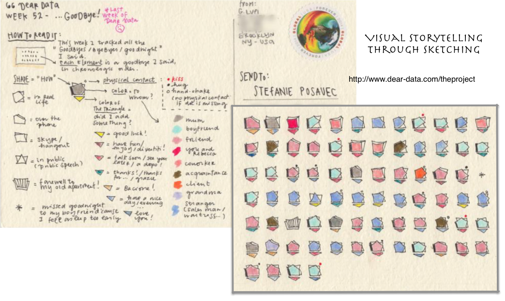

# Data Visualisation for Professionals

This online course teaches how to
* visually explore data
* criticise data visualisations, 
* design visualisations, and 
* implement data visualisations. 

It teaches the fundamentals of 
* human perception and data visualisation, 
* exploratory data analysis and 
* the importance of interaction in exploration, 
* techniques for data visualisation (networks, temporal data, geographic data, etc..), 
* storytelling and communication, as well as 
* tools for data visualisation (e.g., Tableau, Rawgraphs, D3.js).

Contextual knowledge plays a key role in data interpretation and use. While this may be harnessed to create more meaningful, insightful visualisations, context may also be exploited to unfairly influence or actively mislead - topics that will be covered during the course. We encourage **BYOD---bring and work on your own data project** (we can sign non-disclosure agreements). Alternatively, class examples will include open-access data on a variety of topical issues such as [climate change](https://climateknowledgeportal.worldbank.org), [COVID-19](https://github.com/CSSEGISandData/COVID-19) and gender participation (e.g., [the No Ceilings project](http://www.noceilings.org/about) ([github repository](https://github.com/fathominfo/noceilings-data)), and [Scotland's Open Data Catalogues](http://okfnscot.github.io/open-data-scotland).

### Learning Outcomes
1. **Analyse:** Describe a challenge for a visualisation project and the reasons why visualisation is required. 
2. **Structure:** Break down the project considering its context (target audience, usage scenario), potential tasks that the visualisation should facilitate, and the characteristics of the data set.
3. **Design+Implement:** Create a visualisation through one of various media (website, interactive, infographic, etc.) and through a self-selected set of tools (e.g., Tableau, D3.js), to match the earlier identified challenge.
4. **Evaluation:** Critically reflect on a visualisation design and suggest constructive solutions. 
5. **Apply:** Competently apply a wide range of visualisation techniques and tools, also knowing their particular features and drawbacks.le

### Takeaways 
* A **certificate** to reflect a 10 credit-bearing course at Masters-level (SCQF Level 11)
* **Visual representation** of your dataset that enables you to answer the challenge you defined around it before and during the course.
* **Skills** to develop further visual literacy to support data-driven work.

## Course Summary

This course teaches general knowledge about theory, application, design, and evaluation of visualisations. The goal of the course is to enable participants to understand the potential of visualisation for exploration, analysis, and communication.  
</img>

The course targets professionals working in, among others, finance, the sports industry, the creative industry, in journalism, education and in the public sector. It will enable participants to describe a visualisation problem, to explore the data using data visualisation, to discuss and design appropriate visualisation concepts, and to implement and critically reflect on them. The bi-disciplinary approach, from the Computer Science and Social Sciences perspectives, aims to increase accessibility and ensures both grounding in technical understanding and application across sectors.  

The course is designed for an interdisciplinary audience, targeting participants with a background in design, data analysis, and other areas. In addition to core, manadatory [topics](./content.html) that aim to develop visual literacy, participants can chose from a variety of optional, more specialised topics during the course.

General __programming skills are not required__ but those with a good understanding of JavaScript, python or R can learn how to use visualisation libraries such as D3.js, [https://d3js.org](https://d3js.org). The course will give you an overview of a range of commercial and open source tools to help you decide what works best for your project and skills.  
</img>

The final assessment will require participants to work on an open visualisation project of their choice, which can, e.g., include their own data or use open data. The end goal could be any of, but not limited to, the following: 

<table>
  <tr>
    <td style="vertical-align:top;width:100px;"></td>
  </tr>
</table>

<table>
  <tr>
    <td style = "vertical-align:top;" colspan = "2">
      <ul>
        <li>an infographic, </li>
        <li>an interactive visualisation (e.g., using d3.js, <a href="https://plot.ly">Plotly</a>) </li>
      </ul>
    </td>
  </tr><tr>
    <td  style = "horizontal-align:center;" colspan = "2"></img>
    </td>
  </tr>
</table>
<table>
  <tr>
    <td style = "vertical-align:top;">
      <ul>
        <li>a data-driven, visual story or narrative such as a <a href="http://datacomics.net">data comic</a>.</li>
      </ul>
    </td>
    <td style = "vertical-align:center; width:150px;"></img></td>
  </tr>
</table>

Individual help and feedback will be provided through forums and email, drop-in online-sessions, and local workshops in Edinburgh. 

The course delivery is meant to be as flexible as possible to accommodate each participant’s work schedule. Course content is delivered through recorded online video lectures, suggested readings, online tutorials, quizzes, exercises that can be handed in to obtain feedback as well as optional advanced modules.

Tutorials and talks will be held at the University of Edinburgh and live-streamd and recorded for an online audience. 

Prior to course start, we aim to work with selected participants to shape the course to best accomodate specific needs by professionals. 

__[Register interest](https://www.ed.ac.uk/bayes/about-us/our-work/education/workforce-development/courses/data-visualisation/register-your-interest)__

## Course Delivery Information
* Start Date: 15 June 2020
* Course Duration: 5 weeks
* Total Hours: 100 (Lecture Hours 20; Tutorial Hours 16; Independent Study Hours 72) 
* Method of Assessment: Coursework 100%

## Entry Requirements
A UK 2:1 honours degree, or its international equivalent.  
If you __do not__ meet the minimum academic requirement, you may still be considered if you have relevant work experience preferably with:

* a basic knowledge of programming in Python or JavaScript.
* experience using Adobe Illustrator or equivalent
* experience creating basic visualisations in Excel, Tableau or PowerBI

If you are unsure whether you meet these criteria please send your CV to [bayes-training@ed.ac.uk](bayes-training@ed.ac.uk).

## Financial Support
Contact [bayes-training@ed.ac.uk](bayes-training@ed.ac.uk) for information on funding options and fee waivers.

## English Language Requirements
You must demonstrate English language competency at a level that will enable you to succeed in your studies, regardless of your nationality or country of residence.
Find out more about our [language requirements](http://www.edin.ac/pgdf-english).
