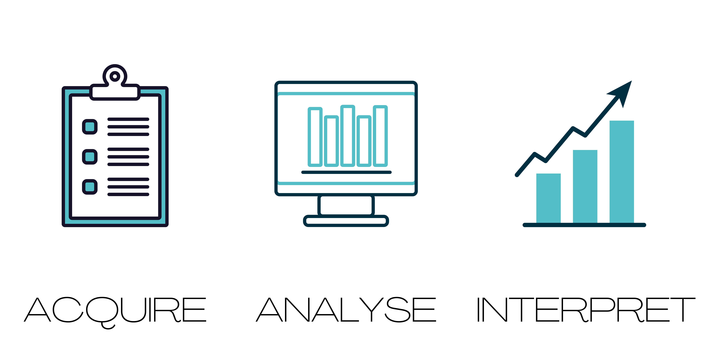

# Course in Data Science for Manufacturing

The [University of Edinburgh](https://www.ed.ac.uk) is hosting, a university-certified, _10-credit_, online course in data science for manufacturing with flexible schedule. The course runs in 2022 from __February 04th - April 14th (10 weeks)__ and is dedicated to professionals in---among others---the manufacturing sector.

This online course teaches how to
* Set some context 
  * What types of data can be found in manufacturing
  * How that data can be used on a big level
  * Tactically how the data can be used to optimize processes
* Particular topics
  * Data Carpentry
  * Data visualization 
    * Forms of data (Infographics, Interactives, Physicalizations, Comics, Storytelling,Scientific visualization)
* Machine learning/Data analysis

It covers the fundamentals of 
* exploratory data analysis,
* the importance of data science in manufacturing, 
* tools for data analysis,
* tools and techniques for data visualisation, and
* evaluation.
* __Introduce__ you to the ramifications of data collection and use in a manufacturing setting
* __Introduce__ you to __programming__ with Python, version control with Git and Github and other key software practices.
* Develop an __understanding__ of data formats, their wrangling and management, including CSV and relational databases (SQL), CAD formats and materials. 
* __Develop__ skills in the analysis and visualisation of a range of data using descriptive statistics and exploratory data analysis.
* __Criticise__ data use and practises 
* __Introduce__ collaborative practices around data collection, analysis and presentation.

Meet the organizers and join our **[open info session on MS Teams](TEAMS LINK)** (installed MS Teams application required). The session gives an overview over the course and we will answer questions. Sessions times are 
* Day, Month 00, 6-7pm, BST
* Day, Month 00, 6-7pm, BST

With an aim to build skills that allow participants to directly apply their learning, the course features __online videos and reading material__, __tutorial workshops__, __drop-in sessions__,  __complementary online teaching material__, and __seminars by guest speakers__. More about the [course organisation](organisation.html) and its [schedule](content.html).

<!---We encourage **BYOD---bring and work on your own data project** (we can sign non-disclosure agreements). --->
Class examples will include open-access data on a variety of relevant issues such as [Supply Chain Datasets](https://www.kaggle.com/abdelrahmancae/supply-chain-analysis-and-modeling), [Research and Development](https://data.world/ie-central-stats/506f5e92-cf59-48c0-8ad7-943482cca2c7) and quality prediction (e.g., https://www.kaggle.com/edumagalhaes/quality-prediction-in-a-mining-process).

### Learning Outcomes
1. **Understand** : Have knowledge of the data ecosystem of manufacturing companies
2. **Program** : Identify and deploy strategies for writing, understanding and managing computer programs using Python and version control.
3. **Data** : The ability to wrangle, analyse, learn from and visualise a range of data, in a way that demonstrates its relevance to digital manufacturing.
4. **Evaluation:** : Critically reflect on the results and suggest constructive solutions. 
5. **Communicate** : Communicate around manufacture relevant issues, supported by the use of multiple data sources and appropriate analysis.
6. **Apply** : Competently apply data science techniques and tools.
7. **Professionalism** : Working in collaborative, interdisciplinary teams to a high professional standard.

### Takeaways 
* A **certificate** to reflect a 10 credit-bearing course at Masters level (SCQF Level 11)
* **Visual representation** of your dataset that enables you to answer the challenge you defined around it before and during the course.
* **Skills** to use data science effectively on manufacture related problems.
* **Communicate** your findings effectively. 

Browse further detail on the __[course structure](organisation.md)__.

<!-- ## Focus Groups -->

## [Submit Application](https://www.ed.ac.uk/studying/postgraduate/degrees/index.php?r=site/view&edition=2020&id=1002)

Applications are now being accepted for the course. Please note that you **must** state that you are registering for the course ***Data Science for Manufacturing*** in the "Supporting Statement" section of the [application form](https://www.ed.ac.uk/studying/postgraduate/degrees/index.php?r=site/view&edition=2020&id=1002).

## Course Delivery Information
* Start Date: __04 February 2022__
* Course Duration: __10 weeks__, complementing self-directed online and on site learning with one hands-on session per week via a virtual classroom, in addition to a Q&amp;A session to discuss lectures and corresponding exercizes 
* Total Hours: __50-100hrs__ (Lecture Hours 9; Workshop tutorial Hours 18; Independent Study Hours 30-73) 
* Weekly investment: __5-10hrs__, including lectures, workshop tutorials, reading, Q&As, project work.
* Method of Assessment: __Coursework 100%__, including submission of your final project. 
* Assessment information: Written Exam 0%, Coursework 100%, Practical Exam 0%. Weekly check ins of the proposed project in the clinics. You will receive one-on-one and detailed written feedback on your project.
